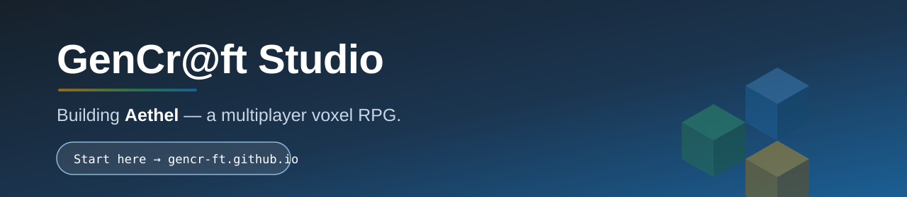

[](https://gencr-ft.github.io)

<h3 align="center">
  <a href="https://gencr-ft.github.io"><strong>🚀 New here? Start at gencr-ft.github.io →</strong></a>
</h3>

<p align="center">
  <em>One command sets up your machine. No manual prerequisites, no guessing which repo matters.</em>
</p>

---

## Our Mission

**Build Aethel — a multiplayer voxel RPG where the world is genuinely the players'.**

Aethel is a creative platform as much as a game: a procedurally generated voxel world with an
authoritative multiplayer server, built to be extended and modded from day one rather than
locked down after launch.

We build it as a **studio of engineering standards, not a pile of scripts**. Every architectural
decision is recorded as an ADR, every document has a traceable ID, every repository declares its
own contract in `AGENTS.md`, and the whole studio is operated through one CLI (`gft`). Our
philosophy is deliberately old-fashioned: simplicity in the Unix tradition, rigour after
Dijkstra, reliability after Hamilton. Empty `catch` blocks are professional malpractice.

## Current Status

Aethel is in **active development and is not yet publicly playable.**

| Area | State |
|------|-------|
| **Game client** | Godot 4.5 / GDScript — voxel rendering, HUD, and inventory in place |
| **Authoritative server** | TypeScript / NestJS on hexagonal architecture, binary wire protocol over uWebSockets.js |
| **World generation** | Rust → WASM, deterministic seeded terrain, biomes, caves and hydrology |
| **Identity** | RS256 JWT with refresh-token rotation (IETF BCP 212) |
| **Persistence** | PostgreSQL via Prisma — world and player state, with autosave |
| **Developer onboarding** | One-line bootstrap, live at [gencr-ft.github.io](https://gencr-ft.github.io) |

A local "walking skeleton" boots the full backend — auth, persistence, simulation — plus the
Godot client, so contributors can see the whole system running on their own machine.

Day-to-day progress is tracked on our
[project boards](https://github.com/orgs/GenCr-ft/projects); each workspace also keeps a
`STATUS.md` in `gcs-project-management`.

## Getting Started

Everything begins at the onboarding hub — it detects your platform, installs what is missing,
signs you in, and clones the right repositories for the work you have been assigned:

### **→ [gencr-ft.github.io](https://gencr-ft.github.io)**

```bash
curl -fsSL https://gencr-ft.github.io/onboard.sh | bash
```

Linux, macOS, and WSL2 on Windows are all supported. You will need a GitHub account with
`GenCr-ft` organization membership — if you do not have it yet, ask your team lead or request
access via [org discussions](https://github.com/orgs/GenCr-ft/discussions).

Pick the workspace you have been assigned. These four ids are the ones the tooling accepts:

| Workspace | What you will work on |
|-----------|----------------------|
| `aethel` | Game client, authoritative server, world generation, auth, persistence |
| `gft-platform` | Platform CLI and architecture, governance, handbooks, security, legal |
| `onboarding` | CI, onboarding automation, governance linters, shared Actions, infrastructure |
| `agent-ecosystem` | Agent operations, blueprints, skills, prompts, automation |

## How Our Repositories Are Named

Roughly thirty repositories, prefixed by layer:

| Prefix | Layer |
|--------|-------|
| `gcp-` | Product — the Aethel game itself |
| `gcl-` | Shared libraries and microservices |
| `gcd-` | DevOps and developer tooling |
| `gcs-` | Studio-wide standards and handbooks |
| `gct-` | Templates |

## Primary Entry Points

- [gcp-aethel-client](https://github.com/GenCr-ft/gcp-aethel-client) — Godot 4.5 game client
- [gcp-aethel-server](https://github.com/GenCr-ft/gcp-aethel-server) — authoritative game server
- [gcp-aethel-pcg](https://github.com/GenCr-ft/gcp-aethel-pcg) — Rust/WASM procedural generation
- [gcs-plt-tools](https://github.com/GenCr-ft/gcs-plt-tools) — the `gft` studio CLI
- [gcp-aethel-architecture](https://github.com/GenCr-ft/gcp-aethel-architecture) — ADRs and C4 diagrams
- [gcs-project-management](https://github.com/GenCr-ft/gcs-project-management) — planning and tracker state

**After cloning any repository, read its `AGENTS.md` first** — it is the authoritative source for
that repo's stack, commands, and boundaries.

## Contributing

Read [CONTRIBUTING.md](../CONTRIBUTING.md) and our [Code of Conduct](../CODE_OF_CONDUCT.md).
Every pull request needs a GitHub issue, follows
[Conventional Commits](https://www.conventionalcommits.org/en/v1.0.0/), and ships with tests.

Found a security issue? Please follow [SECURITY.md](../SECURITY.md) rather than opening a public
issue.
